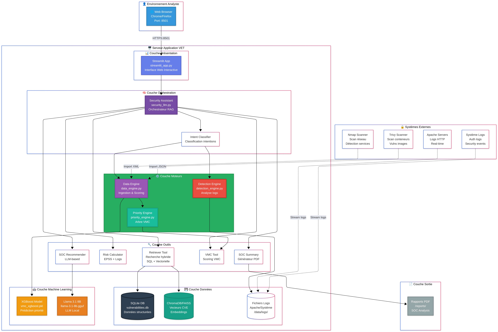

# SOC AI Orange - VET

Projet académique collectif réalisé en Master 2 Cybersécurité, en
collaboration avec Orange, de novembre 2025 à mars 2026.

VET (Vulnerable Exploitation Tool) explore l'utilisation d'un assistant IA
pour aider les analystes SOC à distinguer les vulnérabilités réellement
prioritaires des vulnérabilités uniquement théoriques.

## Problématique

Les équipes SOC doivent traiter un volume important de vulnérabilités et
d'alertes. Un score CVSS élevé ne signifie pas nécessairement qu'une faille
sera exploitée, tandis qu'une vulnérabilité moins sévère mais présente dans
CISA KEV peut nécessiter une action immédiate.

VET cherche à répondre à une question centrale :

> Comment combiner la sévérité, la probabilité d'exploitation, le contexte du
> système et les traces observées pour proposer une priorité compréhensible à
> l'analyste ?

## Approche

Le prototype associe :

- **CVSS** pour mesurer la sévérité technique ;
- **EPSS** pour estimer la probabilité d'exploitation ;
- **CISA KEV** pour identifier les vulnérabilités exploitées ;
- **VMC et XGBoost** pour produire une priorité explicable ;
- **SQLite et FAISS** pour combiner recherche structurée et sémantique ;
- **RAG et Llama 3.1** pour générer une analyse contextualisée ;
- **analyse des logs** pour rapprocher le risque théorique des événements
  réellement observés.

## Architecture

Le flux étudié suit cinq étapes :

1. ingestion et normalisation des informations CVE ;
2. enrichissement avec CVSS, EPSS et CISA KEV ;
3. indexation dans SQLite et FAISS ;
4. corrélation avec les journaux de sécurité ;
5. génération d'une réponse structurée puis reformulée pour l'analyste SOC.

## Fonctions étudiées

| Domaine | Fonction |
|---|---|
| Priorisation | Classement des vulnérabilités selon leur sévérité, leur exploitabilité et le contexte |
| Recherche | Interrogation hybride SQL et vectorielle |
| Détection | Recherche de traces d'exploitation dans les journaux |
| Assistance | Dialogue en langage naturel avec justification des recommandations |
| Restitution | Tableau de bord Streamlit et génération de synthèses |

## Livrables

- [Présentation initiale et état de l'art](docs/presentation-soc-ai-orange.pdf)
- [Présentation finale du projet](docs/presentation-finale-soc-ai-orange.pdf)
- [Rapport technique](report/soc-ai-orange-report.pdf)

## Points clés

- assistant pensé comme une aide à la décision, pas comme un remplacement de
  l'analyste ;
- exécution locale du LLM étudiée pour préserver la confidentialité des
  journaux ;
- priorisation fondée sur plusieurs indicateurs plutôt que sur le seul CVSS ;
- environnement Docker volontairement vulnérable utilisé uniquement pour les
  essais ;
- pistes d'amélioration : validation humaine, LangGraph, intégration SIEM en
  temps réel et modèles spécialisés.

## Périmètre et usage responsable

Ce dépôt présente les livrables d'un prototype académique collectif. Il ne
contient ni données de production, ni identifiants, ni secrets, ni
infrastructure prête à être exposée.

Le laboratoire décrit dans le rapport est volontairement vulnérable. Il doit
rester isolé et ne doit jamais être déployé sur un environnement de production
ou accessible depuis Internet.

## Auteurs

- Masha Mirza Zad Ziabary
- Abdullah Ahmed-Bark Swailem
- Mirwis Satarzai
- Damien Maris
